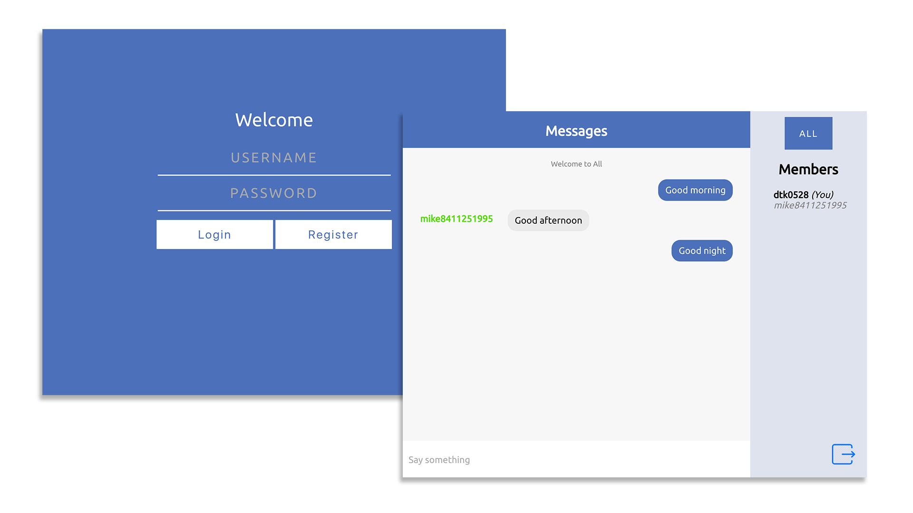

Chat Room
=========
   
  
This is a Node.js chat room powered by Express and socket.io.

## Demo

There is a working live demo at [http://eslab1.azurewebsites.net/](http://eslab1.azurewebsites.net/)

## Features

* Send text message to public room and specific user
* User register and login
* Save login status
* User list showing who is online
* Offline messages
* Notification for new private messages
* Show messages timestamp using tooltips
* Clean design

---

## Setup

#### Get the source code  

	git clone https://github.com/ESLab-2017/Lab1.git 
	cd Lab1
	
#### Download and install all the dependencies

	npm install

  
---
	
## Usage

#### Start server

	npm start

#### Open a browser and go to 

	localhost:8080
	
#### Start chatting!

---

## Built With

* [Express](http://expressjs.com/) - Web framwork for Node.js
* [socket.io](https://socket.io/) - Enables real-time bidirectional event-based communication

---

## Team

 | 
---|---
[Kuan Tung](https://github.com/dtk0528) | [Mike Lee](https://github.com/mike8411251995)
